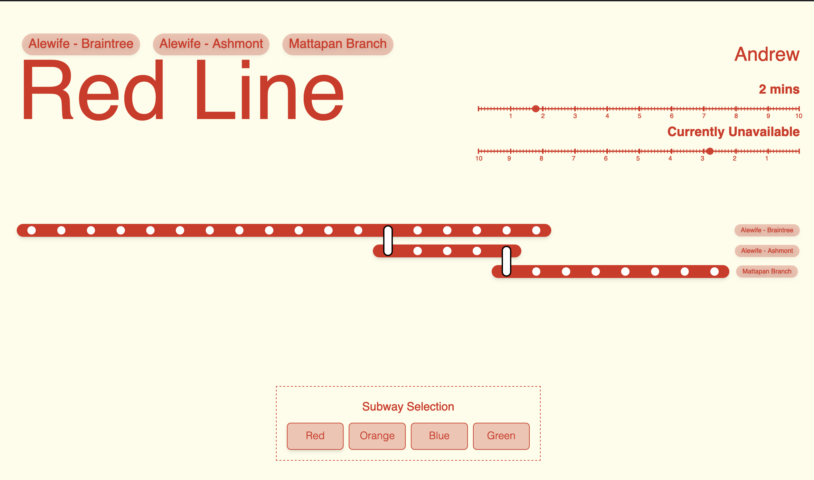

# MBTA Live Data Analytics and Visualization

A project aimed at providing real-time analytics and visualization of data fetched from the Massachusetts Bay Transportation Authority (MBTA) using their REST APIs.

## Overview

The project focuses on retrieving live data from the MBTA's RESTful APIs to analyze and visualize transportation-related information. The application utilizes live data feeds to present insights and visual representations for various MBTA transportation services.

## Project Status

Check out the live version of the project: [MBTA Live Data Analytics](https://mbta-live-next.vercel.app/) - Note: Optimized for Firefox browser.

## Features

- Real-time data retrieval from MBTA APIs
- Data analytics and insights
- Visualizations of transportation-related information

